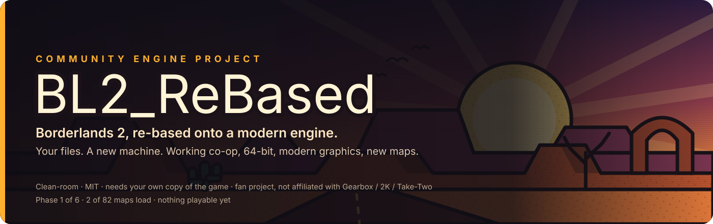

<div align="center">



<br>

[](https://github.com/zuhuHix/BL2_ReEngine/actions/workflows/ci.yml)
[](LICENSE)


[](https://github.com/zuhuHix/BL2_ReEngine/discussions)

**A new engine that runs Borderlands 2 from the copy you already own — so it can finally have working co-op, 64-bit, modern graphics and new maps.**

[The 60-second version](#the-60-second-version) · [What you'd get](#what-youd-get) · [Roadmap](#roadmap) · [Where we are](#where-we-are-today) · [Is this legal?](#is-this-legal) · [How to help](#how-to-help) · [For developers](#for-developers)

</div>

> [!IMPORTANT]
> **There is nothing to play yet.** Right now BL2_ReBased can read every file in a Borderlands 2 install and show two maps as frozen scenery inside Unreal Engine 5. No guns, no enemies, no story. We went public early so you can watch it grow — not because it's ready.
>
> BL2_ReBased is a fan project. It is **not** affiliated with Gearbox, 2K or Take-Two. It contains **no game files** and **no Gearbox code**, and it only works with **your own purchased copy** of Borderlands 2.

---

## The 60-second version

Think of Borderlands 2 as two things:

| | What it is | State in 2026 |
|---|---|---|
|  **The stuff** | Maps, guns, characters, sounds, the story, the skill trees — all files sitting in your game folder | Brilliant. People still love it 14 years later. |
|  **The machine** | `Borderlands2.exe` — the 2012 program that loads the stuff and turns it into a game | Old, 32-bit, locked. Nobody outside Gearbox can change it. |

Every big problem players complain about lives in **the machine**: multiplayer breaking, "out of memory" crashes, no ultrawide, no new maps, no level editor. Mods can change the *stuff*, but they can't touch the *machine* — and the machine is where the #1 complaint (broken co-op) lives.

**BL2_ReBased builds a new machine.** It reads the original stuff straight from your game folder, exactly as it shipped, and runs it on a modern engine (Unreal Engine 5). We copy nothing, we ship nothing of Gearbox's, and we never touch your original game.

This is the same idea as [OpenMW](https://openmw.org/) (Morrowind), [OpenRCT2](https://openrct2.org/) (RollerCoaster Tycoon 2) and [Ship of Harkinian](https://www.shipofharkinian.com/) (Ocarina of Time). Those projects work, and they've been around for years. Nobody has done it for a game like Borderlands 2 — that's the whole challenge.

<details>
<summary><b>Why can't mods just fix this?</b></summary>

<br>

We researched this properly before starting — 3,300 Steam reviews, 250 forum threads, and a forensic look at the installed game. Short version: mods can deliver about 80% of what players ask for (balance, quality of life, new guns, sharper textures). But the remaining 20% is exactly the stuff people want *most*, and it's physically inside the executable:

- **Co-op** runs through a backend mods can't replace
- **64-bit** needs the engine recompiled — only Gearbox can do that
- **Modern graphics** are blocked by the 2012 DirectX 9 renderer baked into the exe
- **New maps** need an editor that was stripped out before the game shipped

Full research: [docs/BL2_REMASTER_ANALYSIS.md](docs/BL2_REMASTER_ANALYSIS.md). There's even a complete design for the mod route as a fallback: [docs/DESIGN_OVERHAUL_MOD.md](docs/DESIGN_OVERHAUL_MOD.md).

</details>

## What you'd get

When it's done — and "done" is years away, see the roadmap — this is what a new machine makes possible:

| | |
|---|---|
|  **Co-op that works** | Our own multiplayer. No SHiFT, no forced account linking, no "hardlock on the title screen." |
|  **64-bit** | The ~4 GB memory wall behind most crashes and the Ultra HD pack problems — gone. |
|  **Modern graphics** | Real ultrawide, any resolution, unlocked framerate, optional modern lighting. |
|  **New maps** | Borderlands 2 never got a level editor. Unreal Engine 5 comes with one. |
|  **Your mods still work** | Text mods (BLCMM) edit the same data we load. The plan is for them to just carry over. |
|  **Your saves still work** | Real save files, same characters. |
|  **It can't be taken away** | If the servers go, the game keeps working. |
|  **The Pre-Sequel too** | Same engine underneath, so it comes along later. |

## Roadmap

Six phases. Each one ends with a **gate** — a thing you can see or do — so it's always clear whether we're actually moving.


| Phase | In plain words | What you'll be able to do | Time (est.) | Status |
|:--|:--|:--|:--|:--|
| **0 · Read the files** | Teach the new engine to open every Borderlands 2 file | Nothing yet — it's the proof the idea works | 3–6 weeks |  Done — in a day |
| **1 · See the maps** | Rebuild every map, texture and object inside UE5 | Fly around all 82 maps in a modern engine. Museum tour — no enemies, no guns | 2–4 months |  **Now** — 2 of 82 maps |
| **2 · Run the game's brain** | Make Borderlands 2's own game logic execute. 64% of the game's code is data in the files; we run it as-is | Nothing visible — this is the invisible layer that runs missions, skills and guns | +3–6 months |  |
| **3 · Make a body move** | Walking, jumping, falling, animation, collision | A test character moves around a real map the way it should | +6–12 months |  |
| **4 · Guns, skills, enemies** | The hard part: rebuild ~3,800 pieces of Gearbox's code by watching the real game and matching it | Spawn, fight, loot a gun, use a skill, die, respawn. **The first thing that feels like Borderlands** | +1–2 years |  |
| **5 · The whole campaign** | Missions, cutscenes, menus, saves, every map populated | Play Claptrap to the Warrior with your real save file | +1–2 years |  |
| **6 · Beyond** | Our own co-op, DLC, The Pre-Sequel, mods, level editor | Everything on the wish list | ongoing |  |

**Total to a finished campaign: roughly 3–5 years** for one person working near full-time with AI assistance. That's an honest range, not a promise — and Phase 0 taking a day instead of weeks does *not* mean the rest will go 30× faster. Phase 0 was porting code that already existed; Phase 4 is reverse-engineering thousands of undocumented functions one at a time.

We also wrote down [when we'd give up](docs/OPENWILLOW_ENGINE_PLAN.md#9-kill-criteria--be-honest-with-yourself), so you never have to guess if the project is dead.

The detailed, checkbox-level tracker is [ROADMAP.md](ROADMAP.md).

## Where we are today

*Updated 2026-09-13. Project started 2026-09-09.*

-  The new engine reads **all 2,008 files** in a full Borderlands 2 install (base game + every DLC) — every one, no errors
-  It can pull out textures and 3D models, and they look right
-  Two maps — **Ash** (the Eridium Blight area) and **Sanctuary** — load as frozen scenes in Unreal Engine 5 with their real textures
-  You can fly through them with a free camera
-  The sky is black, some surfaces are white, nothing moves, there's no collision, and it runs slowly
-  80 maps to go before Phase 1's gate

<details>
<summary><b>Show me the numbers behind those checkmarks</b></summary>

<br>

Every claim above comes from a dated verification record. Automated checks are always reported separately from "a human looked at it," and anything we couldn't verify is labelled `UNVERIFIED` in the code and docs.

| Milestone | Evidence |
|---|---|
| Phase 0 gated 2026-09-10 | Reader reads 2,008 / 2,008 packages: 4,751,329 serialized exports. Nine code packages decode byte-for-byte identically to an independent Python reader. Tagged properties on a real weapon part match BLCMM's dump. One mesh and one texture extracted and rendered in UE 5.8. |
| Phase 1 in progress | `Ash_P` (5,059 placements) and `Sanctuary_P` (4,430 placements, 9 sublevels) load as frozen scenes with a four-channel material approximation, an inspection lighting rig and a free-flight camera. Saved scenes reopen with zero verification errors. Not done: sky, terrain/BSP, skeletal meshes, lightmaps, real material graphs, walking collision, performance (~8–9 FPS on Sanctuary), 80 more maps. |

Records: [decisions log](DECISIONS.md) · [Material v1 / Ash](docs/verification/MATERIAL_LEVEL_V1_VERIFICATION.md) · [Phase 1 viewer](docs/verification/PHASE1_VIEWER_VERIFICATION.md) · [cooked materials](docs/verification/COOKED_MATERIAL_VERIFICATION.md).

Screenshots of loaded maps are game-derived, so they stay out of the repository. Anyone with the game can reproduce them with the commands in [docs/TOOLING.md](docs/TOOLING.md).

</details>

## Is this legal?

We believe so, and we work hard to keep it that way. The rules — the same ones OpenMW, OpenRCT2 and Ship of Harkinian have lived by for years:

1. **We never share game files.** Not a texture, not a sound, not a screenshot of game content. Nothing of Gearbox's ever enters this repository.
2. **We never use leaked or decompiled code.** We work from file formats and by watching what the real game does. That's it.
3. **You need the real game.** The engine refuses to start without it, and it never modifies your install.
4. **Nobody makes money.** No paid builds, no "premium" anything. Ever.
5. **We say how it's built.** Solo developer, AI-assisted tooling, and every result is checked by hand against the real game before it counts.

Full policy, in plain language: [docs/LEGAL.md](docs/LEGAL.md). License: [MIT](LICENSE) — it covers our code and nothing else.

## How to help

You don't need to code.

-  **Talk** — questions, ideas, "will it do X?" → [Discussions](https://github.com/zuhuHix/BL2_ReEngine/discussions)
-  **Test with your copy** — different DLC, Epic vs Steam, with/without the UHD pack: run our tools and tell us the numbers, or load a map and tell us what looks wrong → [Verification report](https://github.com/zuhuHix/BL2_ReEngine/issues/new?template=verification_report.yml)
-  **Know the file formats?** → [Format finding](https://github.com/zuhuHix/BL2_ReEngine/issues/new?template=format_finding.yml)
-  **Code** — open items are in [ROADMAP.md](ROADMAP.md#now--next); read [CONTRIBUTING.md](CONTRIBUTING.md) first
-  **Star and watch** the repo so you see the Phase 1 release

<details>
<summary><b>FAQ</b></summary>

<br>

**Can I play Borderlands 2 in this?**
No. The first thing you'll be able to do is fly around the maps (Phase 1). Shooting things is Phase 4. The full campaign is Phase 5.

**Is this a remaster? A remake?**
Neither. A remaster re-does the *stuff* (new textures, new models). A remake rebuilds everything from scratch. We keep the original stuff untouched and replace only the *machine* that runs it.

**Will my mods work?**
That's the plan. Text mods edit the same game data we load, so they should carry over once gameplay runs (Phase 4–5). SDK mods will need a compatibility layer later.

**Will my saves work?**
Yes — reading real save files is a Phase 5 task. The save format is already documented by the community.

**Why Unreal Engine 5?**
Borderlands 2 is Unreal Engine *3*. UE3's systems (materials, animation, particles, cutscenes, scripting) all have direct descendants in UE5, so we translate into them instead of inventing replacements. That's a much smaller problem.

**Who's making this?**
One person. I use AI coding tools as part of the workflow — the way you'd use a debugger or a code generator — and I say so because the project's own rules require it. What matters is that nothing counts until it's been run against the real game and the result is written down. Judge the evidence trail.

**Why "ReBased"?**
Because that's literally what it is: Borderlands 2, re-based onto a new engine. (The code still uses the working title *OpenWillow* in identifiers like `ow-package` — "Willow" is Gearbox's internal name for the BL2 engine.)

**What if it fails?**
We wrote down the conditions under which we stop, [in the plan](docs/OPENWILLOW_ENGINE_PLAN.md#9-kill-criteria--be-honest-with-yourself). If it fails, the repo says so, and the research and tools stay useful to the modding community.

</details>

---

## For developers

Everything below is the technical layer. Click to expand.

<details>
<summary><b>How it works — architecture</b></summary>

<br>

Measured directly from the installed game: 20,119 functions across the nine code packages. **12,978 (64.5%) are UnrealScript bytecode** and will run in our VM as-is. **7,141 (35.5%) were native C++** inside `Borderlands2.exe` and must be rebuilt — of which 286 are trivial builtins, 609 are online/save/DLC plumbing we replace rather than replicate, 512 bridge the Scaleform UI, 1,914 are stock UE3 natives whose contracts are public via UDK, and **3,803 are Gearbox's own, undocumented**. Full breakdown: [engine plan §0](docs/OPENWILLOW_ENGINE_PLAN.md#0-ground-truth--the-numbers-this-plan-rests-on).

Three layers. The script VM and the asset pipeline are engine-agnostic C++; the native layer is where the host engine shows up.

```
                 ┌──────────────────────────────────────────────────────┐
                 │  HOST ENGINE (UE5: renderer, physics, audio, UI)     │
                 └───────────────▲──────────────────────▲───────────────┘
                                 │                      │
   ┌─────────────────────────────┴───┐    ┌─────────────┴──────────────────┐
   │  NATIVE LAYER (C++)             │    │  ASSET PIPELINE  ◄── Phase 1   │
   │  the 7,141 rebuilt functions    │    │  package loader (UPK/TFC)  [done] │
   │  Actor/Pawn/Controller, traces, │    │  textures, static meshes   [done] │
   │  movement, animation, particles,│    │  materials (approximation) [wip]  │
   │  AI, stat core, weapons, UI     │    │  levels (actors+transforms)[wip]  │
   └─────────────────────────────▲───┘    │  skeletal, anim, lightmaps,    │
                                 │        │  Kismet, Wwise, Bink, SWF  [todo] │
   ┌─────────────────────────────┴───┐    └────────────────────────────────┘
   │  UNREALSCRIPT VM  ◄── Phase 2   │
   │  UObject model, bytecode        │
   │  interpreter, states, latents,  │
   │  native dispatch table          │
   └─────────────────────────────────┘
        runs the 12,978 inherited functions unchanged
```

**Host engine: Unreal Engine 5.** UE3's material graphs, AnimTrees, Cascade, Matinee and Kismet all have direct UE5 descendants to translate *into*. The plan required this decision by the Phase 0 gate and rules out switching later; all Phase 1 work targets UE 5.8. Reasoning and the alternative considered (Godot): [engine plan §2.1](docs/OPENWILLOW_ENGINE_PLAN.md#21-host-engine-decision--decide-by-end-of-phase-0-never-after).

</details>

<details>
<summary><b>How we build it — methodology</b></summary>

<br>

**Clean room, strictly.** File formats and observed behaviour only. No leaked source, no decompiled executable code. Public reference implementations (UE Viewer, UDK headers) are read for serialization *order* and never copied; every reference and its license is in [THIRD_PARTY.md](THIRD_PARTY.md).

**Three sources of truth.** Every rebuilt native needs a definition of "correct": (A) **UDK**, a free running UE3, for the 1,914 stock natives; (B) **the original game, instrumented** with [unrealsdk](https://github.com/bl-sdk) — hook a function, log its inputs and outputs during play, implement until our engine reproduces the log; (C) **community documentation** (BLCM wiki, bl2.parts, Lootlemon) for stat math. A native without a golden file is a guess, and guesses are labelled `UNVERIFIED`.

**Evidence first.** Every change ends in a check that can be performed against the real game, and the check is written down. Synthetic tests run in CI; differential checks run against a real install; visual checks are done by a human. [DECISIONS.md](DECISIONS.md) records every architectural choice, what was verified, and what wasn't.

**Solo developer, AI-assisted.** One person owns every architectural decision, every verification against the real game, and every license and provenance call. AI coding tools are part of the workflow, under a written brief ([CLAUDE.md](CLAUDE.md)) and guard hooks in [`.claude/`](.claude/) that require a confirmation before anything touches bounds-checking code, dependency wiring or license files.

</details>

<details>
<summary><b>Build and run it</b></summary>

<br>

You need: Windows, CMake, Visual Studio 2022 C++ build tools, Python 3, and an installed Borderlands 2. Unreal Engine 5.8 is only needed for the map viewer.

```powershell
cmake -S . -B build -G "Visual Studio 17 2022" -A x64
cmake --build build --config Release
ctest --test-dir build -C Release --output-on-failure          # synthetic tests, no game needed
python tools/verify_packages.py --reader build/Release/ow-package.exe   # needs the game
& ./build/Release/ow-package.exe "C:/Program Files (x86)/Steam/steamapps/common/Borderlands 2/WillowGame/CookedPCConsole/Core.upk"
```

Inspecting properties, running the full-install census, extracting a texture or mesh, preparing and opening a map in the UE5 viewer: [docs/TOOLING.md](docs/TOOLING.md). Everything the tools produce lands under `local/`, which is git-ignored — extracted assets never enter the tree.

The code keeps the working-title prefixes from before the rename: the reader is `ow-package`, the CMake option is `OPENWILLOW_LZO`, the UE host reads `OPENWILLOW_BL2`.

</details>

<details>
<summary><b>What's implemented right now</b></summary>

<br>

A standalone x64 C++20 tool, `ow-package`, reads version 832/46 packages: name/import/export tables; fully and partially LZO-compressed containers; object records with outer paths; a `PackageStore` that indexes an install lazily and resolves imports across packages; per-class export census; tagged properties (scalars, object refs, nested and fixed-layout structs, arrays via a schema file); resident `Texture2D` mips to PNG (DXT1/DXT5, inline or TFC-streamed); all render LODs of a `StaticMesh` and one LOD to OBJ; bulk scene metadata and bounded payload bytes for the level preparer.

`tools/prepare_level.py` follows a map's serialized sublevel references, extracts reusable mesh sections and four-channel materials, and writes a manifest. `host/ue5/` is a minimal UE5 C++ project plus editor-Python importer/verifier that builds the scene, an inspection lighting rig and a free-flight spectator pawn, then reopens the saved scene and verifies it.

Not implemented: class/default inheritance, runtime package streaming, non-DXT pixel formats, terrain/BSP, skeletal meshes, lightmaps, material graph translation, collision, any gameplay.

Full detail and what each check does and does not prove: [docs/TOOLING.md](docs/TOOLING.md).

</details>

<details>
<summary><b>All the documents</b></summary>

<br>

| | |
|---|---|
| [ROADMAP.md](ROADMAP.md) | Checkbox-level tracker: done, next, blocked |
| [DECISIONS.md](DECISIONS.md) | Dated log of every architectural and parsing decision and its evidence |
| [docs/OPENWILLOW_ENGINE_PLAN.md](docs/OPENWILLOW_ENGINE_PLAN.md) | The plan: numbers, architecture, sources of truth, phases, estimates, kill criteria |
| [docs/BL2_REMASTER_ANALYSIS.md](docs/BL2_REMASTER_ANALYSIS.md) | Research: what players actually want, what modding can and cannot reach |
| [docs/DESIGN_OVERHAUL_MOD.md](docs/DESIGN_OVERHAUL_MOD.md) | The fallback: an in-engine overhaul mod design, if the engine route fails |
| [docs/TOOLING.md](docs/TOOLING.md) | Every tool, flag and command, with what each check proves |
| [docs/verification/](docs/verification/) | Dated verification records for each shipped slice |
| [docs/LEGAL.md](docs/LEGAL.md) | Clean-room policy, non-affiliation, contributor certification, license |
| [THIRD_PARTY.md](THIRD_PARTY.md) | Dependency and reference provenance |
| [CONTRIBUTING.md](CONTRIBUTING.md) | How to contribute, and the sensitive areas |
| [CODE_OF_CONDUCT.md](CODE_OF_CONDUCT.md) | Contributor Covenant 2.1 |
| [research/](research/README.md) | The community-demand corpus and the original Python package reader |

</details>

---

<div align="center">
<sub>BL2_ReBased is an independent fan project. Borderlands and related marks are trademarks of their respective owners. Not affiliated with, endorsed by or supported by Gearbox Software, 2K Games or Take-Two Interactive. Formerly "OpenWillow".</sub>
</div>
