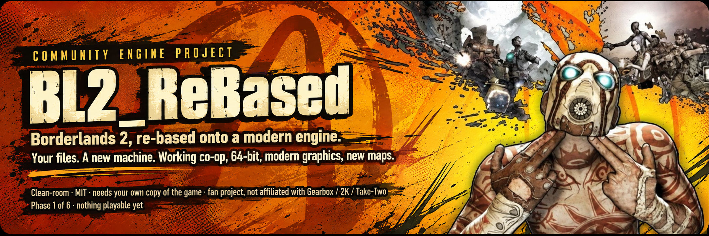

<div align="center">



[](https://github.com/zuhuHix/BL2_ReEngine/actions/workflows/ci.yml)
[](LICENSE)
[](https://github.com/zuhuHix/BL2_ReEngine/discussions)

</div>

# Borderlands 2 ReBased

Hey, I'm zuhu. This is Borderlands 2 ReBased.

Borderlands 2 runs on Unreal Engine 3, a decade-old engine that Gearbox modified on top of, which makes it even worse to decode than stock UE3. What I'm actually doing here is decoding and reverse-engineering BL2's own game files, and writing custom Python import scripts to bring them into Unreal Engine 5. I want to be clear about this: I'm not modeling copies of anything and I'm not remaking assets from scratch. I'm reading the original files and rebuilding the engine underneath them.

[Why bother?](#why-bother) · [What you'd get](#what-youd-get-eventually) · [Where things stand](#where-things-stand) · [Roadmap](#roadmap) · [Is this legal?](#is-this-legal) · [Help me keep going](#help-me-keep-going) · [For developers](#for-developers)

---

> **There is nothing to play yet.** Right now the engine can read the game's files and show three maps as frozen scenery in UE5. No guns, no enemies, no story. I put this up early so people can watch it grow, not because it's ready.
>
> This is a fan project. Not affiliated with Gearbox, 2K or Take-Two. No game files and no Gearbox code live in this repo. It only works against **your own purchased copy** of Borderlands 2, and it never touches your install.

## Why bother?

Borderlands 2 is basically two separate things. There's *the stuff*: maps, guns, characters, sounds, the story, the skill trees, the files sitting in your game folder right now, and honestly they're brilliant, 14 years later people still love this game. And there's *the machine*: `Borderlands2.exe`, the 2012 program that loads all of that and turns it into a game. It's old, 32-bit, and locked. Nobody outside Gearbox can touch it.

Every big complaint people have (broken co-op, out-of-memory crashes, no ultrawide, no level editor) lives in the machine, not the stuff. Mods can change the stuff. They can't touch the machine.

So this project builds a new machine: something that reads BL2's original files straight out of your game folder, exactly as they shipped, and runs them on UE5. Nothing of Gearbox's ships with it.

Same idea as [OpenMW](https://openmw.org/) (Morrowind), [OpenRCT2](https://openrct2.org/) (RollerCoaster Tycoon 2), and [Ship of Harkinian](https://www.shipofharkinian.com/) (Ocarina of Time). Those work. Nobody's done it for BL2 yet. That's the challenge.

<details>
<summary><b>Why can't mods just fix this?</b></summary>
<br>

Short version: mods can deliver about 80% of what players ask for (balance, QoL, new guns, sharper textures). The remaining 20% is exactly the stuff people want *most*, and it's physically inside `Borderlands2.exe`:

- **Co-op** runs through a backend mods can't replace
- **64-bit** needs the engine recompiled, and only Gearbox can do that
- **Modern graphics** are blocked by the 2012 DirectX 9 renderer baked into the exe
- **New maps** need an editor that was stripped out before the game shipped

Full research: [docs/BL2_REMASTER_ANALYSIS.md](docs/BL2_REMASTER_ANALYSIS.md).

</details>

## What you'd get (eventually)

**The first milestone:** walk around Sanctuary as Maya, grab a gun, Phaselock something and finish a mission, all running on BL2's own game code in UE5. Everything below comes after that.

When it's done (and "done" is years away, see the roadmap, this isn't a remaster, not a remake) here's what a new machine actually buys you:

- **Co-op that works.** No SHiFT, no forced account linking, no hardlock on the title screen.
- **64-bit.** The ~4 GB memory wall behind a lot of the crashes and Ultra HD pack problems: gone.
- **Modern graphics.** Real ultrawide, any resolution, unlocked framerate, optional modern lighting.
- **New maps.** BL2 never got a level editor. UE5 comes with one built in.
- **Your mods still work.** BLCMM text mods edit the same data we load, so they should just carry over.
- **Your saves still work.** Real save files, same characters.
- **It can't be cancelled.** If the servers go, the game keeps working.
- **The Pre-Sequel too.** Same engine underneath, comes along later for free.

## Where things stand

*Updated 2026-09-23.*

Okay, Sanctuary is starting to actually look like Sanctuary.

Three maps load in UE5 and you can fly around them as frozen scenery: **Ash**, **Sanctuary** and **Southpaw Factory**. There are still no guns, no enemies and no story yet.

Since the last update, Sanctuary got a lot of love:

- **The ground finally looks like ground.** Terrain layer blending is recovered, and BSP floors are coming through, backed by a new calibration check so they stay right.
- **The moon base has textures now**, and the moon in the sky is scaled from the game's own `p_moonColor` value instead of a number I made up.
- **The big central structure is fixed.** The pillar shells sit where they should and their textures aren't flipped anymore.
- **Stuff that shouldn't be there is gone.** Every placement the game marks as hidden is now hidden, and oversized invisible blockers keep their collision without covering the city.
- **The sky** still uses `Sky_Dome`'s own textures and settings (a labeled approximation, since the stripped sky graph isn't decoded yet).

Under the hood, the engine still reads all 2,008 packages from a full BL2 install (base game plus every DLC) with zero errors. The first native-function dispatch stubs are in too, a tiny first step toward Phase 2 (actually running the game's code).

Honest caveats: it's not full visual parity yet, walking is still a placeholder, it runs slowly on my laptop, and 79 maps haven't been touched. Details are in the [terrain handoff](docs/verification/SANCTUARY_TERRAIN_BSP_HANDOFF.md).

**Next up:** finishing Sanctuary's last visual gaps, then Maya: movement, a few guns and Phaselock. Full list in [ROADMAP.md](ROADMAP.md#now--next); the small ones are tagged *good first task*.

<details>
<summary><b>Show me the numbers behind that</b></summary>
<br>

Every claim above comes from a dated verification record. Automated checks are reported separately from "a human looked at it," and anything unverified is labelled `UNVERIFIED` in the code and docs.

| Milestone | Evidence |
|---|---|
| Phase 0 gated 2026-09-10 | Reader reads 2,008 / 2,008 packages: 4,751,329 serialized exports. Nine code packages decode byte-for-byte identically to an independent Python reader. Tagged properties on a real weapon part match BLCMM's dump. One mesh and one texture extracted and rendered in UE 5.8. |
| Phase 1 in progress | `Ash_P` (5,059 placements), `Sanctuary_P` (4,430 placements) and `SouthpawFactory_P` (3,987 placements) load as frozen scenes with a four-channel material approximation, an inspection lighting rig, a Sanctuary `Sky_Dome` sky approximation built from the dome's own inputs (UE5 atmosphere kept for ambient light), an opt-in outer-hull import and a free-flight camera. Saved scenes reopen with zero verification errors. A command-line selector lists 37 base-game maps (82 with `--include-dlc`); an in-game Tab list switches between imported scenes. Walking is an opt-in placeholder verified on Sanctuary only. Sanctuary runs at 12–15 FPS on an integrated-GPU laptop, GPU-bound in TSR. Sanctuary terrain floors are imported with corroborated topology and walkable triangle collision. Not done: native sky graph decode and parity, skeletal meshes, lightmaps, real material graphs, full collision, 79 more maps. |

Records: [decisions log](DECISIONS.md) · [Material v1 / Ash](docs/verification/MATERIAL_LEVEL_V1_VERIFICATION.md) · [Phase 1 viewer](docs/verification/PHASE1_VIEWER_VERIFICATION.md) · [cooked materials](docs/verification/COOKED_MATERIAL_VERIFICATION.md) · [map selection / Southpaw Factory](docs/verification/MAP_SELECTOR_VERIFICATION.md) · [UV / winding](docs/verification/UV_WINDING_VERIFICATION.md) · [collision and walking](COLLISION_WALKING_VERIFICATION.md) · [performance / in-game selector](docs/verification/PERFORMANCE.md) · [umodel cross-check](docs/verification/UMODEL_CROSSCHECK.md) · [object-dump cross-check](docs/verification/BLCMM_DUMP_CROSSCHECK.md) · [BSP texture axes](docs/verification/BSP_TEXTURE_AXES.md).

Screenshots of loaded maps are game-derived, so they stay out of the repository. Anyone with the game can reproduce them with the commands in [docs/TOOLING.md](docs/TOOLING.md).

</details>

## Roadmap

Six phases. Each one ends with a gate (a thing you can actually see or do) so it's always clear whether this is moving.

**Current priority: a vertical slice, not breadth.** Porting all 82 maps is the easy part of this project. The hard, unproven part is phases 2 through 4, actually running the game's code. So right now the goal is proving those on **one map (Sanctuary, already the furthest along) and one Vault Hunter** end-to-end, before spending more time on additional maps or characters. Full details and why: [ROADMAP.md](ROADMAP.md#priority-the-vertical-slice).

| Phase | What you'll be able to do | Time (est.) | Status |
|:--|:--|:--|:--|
| **0 · Read the files** | The engine can open every BL2 file | ~3–6 weeks | Done (took a week) |
| **1 · See a map** | Fly around Sanctuary in UE5, verified against the real game. No enemies, no guns yet. Full 82-map coverage comes later, in phase 5 | ~2–4 months | In progress (1 of 82 targeted for now) |
| **2 · Run the game's brain** | BL2's own gameplay code executes, scoped to Sanctuary and one Vault Hunter | +3–6 months | Not started |
| **3 · Make a body move** | Walking, jumping, falling, animation, collision, scoped to that same slice | +6–12 months | Not started |
| **4 · One Vault Hunter, proven** | Spawn, fight, loot a gun, equip it, use a skill, complete one mission, die, respawn, on Sanctuary. ~3,800 of Gearbox's undocumented functions reverse-engineered by watching the game (this is the mountain). This is the vertical slice | +1–2 years | Not started |
| **5 · Fill it out** | The remaining ~79 maps and 5 Vault Hunters, deferred from phases 1 and 4, plus the whole campaign with your real save file | +1–2 years | Not started |
| **6 · Beyond** | Co-op, DLC, The Pre-Sequel, mods, level editor | ongoing | Not started |

**Total to a finished campaign: 3–5 years.** One person, AI-assisted. Honestly, not overpromising. Phase 4 is the mountain and that's where most of the time goes.

## Help me keep going

This is a solo project, full stop. I live in Portugal and make about €1k a month, so spending a tenth of my salary on this every month just isn't realistic. AI does most of the decoding grunt work (I run a couple of ChatGPT setups I call Astra and Luna) and it's genuinely fast and good at this, that's how we got this far this quickly. But I'm on a €20/month subscription, and I can't just throw a chunk of my income at a passion project.

Borderlands 2 has always been my favourite game. My childhood game. This project is really close to my heart and I mean that sincerely. You can follow along and expect weekly updates, assuming I haven't burned through a month's AI usage in the first three days of the week. Which, uh, happened this week.

If you want to help me spend way more time on this (a better subscription, maybe eventually a game dev coach who can point me in the right direction) there's a Buy Me a Coffee link below. I also have a Patreon, but that one's more tied to my YouTube and TikTok stuff.

I'm not sure anyone actually reads this far, but if you did, thank you for checking the project out. I'm open to any constructive criticism, and if you feel like sending a PR, go for it.

[](https://buymeacoffee.com/zuhu)

## Is this legal?

Yes. I take it seriously. The rules are the same as [OpenMW](https://openmw.org/) (Morrowind) and [OpenRCT2](https://openrct2.org/) (RollerCoaster Tycoon 2):

1. **I never share game files.** Not a texture, not a sound. Nothing extracted from the game *ever* enters this repository. Extracted assets live locally during import but stay git-ignored.
2. **No leaked or decompiled code.** I work from file formats and by watching what the real game does. That's it.
3. **You need your own copy of BL2.** The engine refuses to start without it, and never modifies your install.
4. **I don't make money from this.** No paid builds, no premium anything. Ever. It's a passion project.

Full policy: [docs/LEGAL.md](docs/LEGAL.md). License: [MIT](LICENSE). Covers my code, nothing else.

<details>
<summary><b>FAQ</b></summary>
<br>

**Can I play Borderlands 2 in this?**
No. The first thing you'll be able to do is fly around the maps (Phase 1). Shooting things is Phase 4. The full campaign is Phase 5.

**Is this a remaster? A remake?**
Neither. A remaster re-does the *stuff* (new textures, new models). A remake rebuilds everything from scratch. This keeps the original stuff untouched and replaces only the *machine* that runs it.

**Will my mods work?**
That's the plan. Text mods edit the same game data this loads, so they should carry over once gameplay runs (Phase 4–5). SDK mods will need a compatibility layer later.

**Will my saves work?**
Yes. Reading real save files is a Phase 5 task. The save format is already documented by the community.

**Why Unreal Engine 5?**
Borderlands 2 is Unreal Engine *3*. UE3's systems (materials, animation, particles, cutscenes, scripting) all have direct descendants in UE5, so we translate into them instead of inventing replacements. That's a much smaller problem.

**Who's making this?**
One person, and I say plainly how: ChatGPT (Astra and Luna) does the grunt work: decoding formats, chasing down smaller one-off tasks. Claude keeps the project organized, and when I've burned through the usage on my €20/month plan, it's also who writes code as a last resort. None of that is a secret and none of it changes the actual rule: nothing counts until it's been run against the real game and the result is written down. Judge the evidence trail, not the tool list. If you want to help cover that €20/month, or just support the hours going into this, there's a [Buy Me a Coffee](https://buymeacoffee.com/zuhu), completely optional.

**Why "ReBased"?**
Because that's literally what it is: Borderlands 2, re-based onto a new engine. (The code still uses the working title *OpenWillow* in identifiers like `ow-package`; "Willow" is Gearbox's internal name for the BL2 engine.)

**What if it fails?**
I wrote down the conditions under which I stop, [in the plan](docs/OPENWILLOW_ENGINE_PLAN.md#9-kill-criteria--be-honest-with-yourself). If it fails, the repo says so, and the research and tools stay useful to the modding community.

</details>

---

## For developers

Everything below is the technical layer. Click to expand.

<details>
<summary><b>How it works: architecture</b></summary>
<br>

Measured directly from the installed game: 20,119 functions across the nine code packages. **12,978 (64.5%) are UnrealScript bytecode** and will run in our VM as-is. **7,141 (35.5%) were native C++** inside `Borderlands2.exe` and must be rebuilt. Of those, 286 are trivial builtins, 609 are online/save/DLC plumbing we replace rather than replicate, 512 bridge the Scaleform UI, 1,914 are stock UE3 natives whose contracts are public via UDK, and **3,803 are Gearbox's own, undocumented**. Full breakdown: [engine plan §0](docs/OPENWILLOW_ENGINE_PLAN.md#0-ground-truth--the-numbers-this-plan-rests-on).

Three layers. The script VM and the asset pipeline are engine-agnostic C++; the native layer is where the host engine shows up.

```
                 ┌──────────────────────────────────────────────────────┐
                 │  HOST ENGINE (UE5: renderer, physics, audio, UI)     │
                 └───────────────▲──────────────────────▲───────────────┘
                                 │                      │
   ┌─────────────────────────────┴───┐    ┌─────────────┴──────────────────┐
   │  NATIVE LAYER (C++)             │    │  ASSET PIPELINE  ◄── Phase 1   │
   │  the 7,141 rebuilt functions    │    │  package loader (UPK/TFC)  [done] │
   │  Actor/Pawn/Controller, traces, │    │  textures, static meshes   [done] │
   │  movement, animation, particles,│    │  materials (approximation) [wip]  │
   │  AI, stat core, weapons, UI     │    │  levels (actors+transforms)[wip]  │
   └─────────────────────────────▲───┘    │  skeletal, anim, lightmaps,    │
                                 │        │  Kismet, Wwise, Bink, SWF  [todo] │
   ┌─────────────────────────────┴───┐    └────────────────────────────────┘
   │  UNREALSCRIPT VM  ◄── Phase 2   │
   │  UObject model, bytecode        │
   │  interpreter, states, latents,  │
   │  native dispatch table          │
   └─────────────────────────────────┘
        runs the 12,978 inherited functions unchanged
```

The host engine is Unreal Engine 5, decided and locked at the Phase 0 gate; the plan rules out switching later. UE3's material graphs, AnimTrees, Cascade, Matinee and Kismet all have direct UE5 descendants to translate *into*, which is the whole reason it won out; all Phase 1 work targets UE 5.8. Full reasoning, and the alternative considered (Godot), is in [engine plan §2.1](docs/OPENWILLOW_ENGINE_PLAN.md#21-host-engine-decision--decide-by-end-of-phase-0-never-after).

</details>

<details>
<summary><b>How we build it: methodology</b></summary>
<br>

Clean room, strictly: file formats and observed behaviour, nothing else. No leaked source, no decompiled executable code. When a public reference implementation (UE Viewer, UDK headers) helps pin down a serialization *order*, we read it (never copy from it) and log the source and its license in [THIRD_PARTY.md](THIRD_PARTY.md).

Every rebuilt native function needs a definition of "correct," and there are exactly three we'll accept. **UDK**, a free running copy of UE3, covers the 1,914 stock natives. **The original game, instrumented** with [unrealsdk](https://github.com/bl-sdk) covers the rest: hook a function, log what goes in and out during real play, then implement until our engine reproduces that log. **Community documentation** (the BLCM wiki, bl2.parts, Lootlemon) fills in stat math the other two don't reach. No golden file behind it, no claim of correctness. Anything without one stays labelled `UNVERIFIED` until it earns that label removed.

That standard isn't just for natives. Every change in this repo ends in a check run against the real game, and the check gets written down: synthetic tests in CI, differential checks against a real install, visual checks by an actual person looking at the screen. [DECISIONS.md](DECISIONS.md) is the record of all of it: every architectural choice, what got verified, and what didn't.

It's a one-person project, and I'm not quiet about the tooling. I own every architectural call, every verification and every license or provenance decision myself, but day to day, ChatGPT (Astra and Luna) handles format decoding and smaller one-off tasks, and Claude handles keeping the project organized plus last-resort coding once I've burned through a month's usage on my plan. Both operate under a written brief ([CLAUDE.md](CLAUDE.md)) and guard hooks in [`.claude/`](.claude/) that require my confirmation before anything touches bounds-checking code, dependency wiring or license files.

</details>

<details>
<summary><b>Build and run it</b></summary>
<br>

You need: Windows, CMake, Visual Studio 2022 C++ build tools, Python 3, and an installed Borderlands 2. Unreal Engine 5.8 is only needed for the map viewer.

```powershell
cmake -S . -B build -G "Visual Studio 17 2022" -A x64
cmake --build build --config Release
ctest --test-dir build -C Release --output-on-failure          # synthetic tests, no game needed
python tools/verify_packages.py --reader build/Release/ow-package.exe   # needs the game
& ./build/Release/ow-package.exe "C:/Program Files (x86)/Steam/steamapps/common/Borderlands 2/WillowGame/CookedPCConsole/Core.upk"
```

Inspecting properties, running the full-install census, extracting a texture or mesh, preparing and opening a map in the UE5 viewer: [docs/TOOLING.md](docs/TOOLING.md). Everything the tools produce lands under `local/`, which is git-ignored, so extracted assets never enter the tree.

The code keeps the working-title prefixes from before the rename: the reader is `ow-package`, the CMake option is `OPENWILLOW_LZO`, the UE host reads `OPENWILLOW_BL2`.

</details>

<details>
<summary><b>What's implemented right now</b></summary>
<br>

A standalone x64 C++20 tool, `ow-package`, reads version 832/46 packages: name/import/export tables; fully and partially LZO-compressed containers; object records with outer paths; a `PackageStore` that indexes an install lazily and resolves imports across packages; per-class export census; tagged properties (scalars, object refs, nested and fixed-layout structs, arrays via a schema file); resident `Texture2D` mips to PNG (DXT1/DXT5/A8R8G8B8, inline or TFC-streamed); all render LODs of a `StaticMesh` and one LOD to OBJ; bulk scene metadata and bounded payload bytes for the level preparer.

`tools/prepare_level.py` follows a map's serialized sublevel references, extracts reusable mesh sections and four-channel materials, and writes a manifest. `host/ue5/` is a minimal UE5 C++ project plus editor-Python importer/verifier that builds the scene, an inspection lighting rig and a free-flight spectator pawn, then reopens the saved scene and verifies it.

Not implemented: class/default inheritance, runtime package streaming, other pixel formats, terrain layer blending, BSP, skeletal meshes, lightmaps, material graph translation, full UE3 collision parity, any gameplay.

Full detail and what each check does and does not prove: [docs/TOOLING.md](docs/TOOLING.md).

</details>

<details>
<summary><b>All the documents</b></summary>
<br>

| | |
|---|---|
| [ROADMAP.md](ROADMAP.md) | Checkbox-level tracker: done, next, blocked |
| [DECISIONS.md](DECISIONS.md) | Dated log of every architectural and parsing decision and its evidence |
| [docs/OPENWILLOW_ENGINE_PLAN.md](docs/OPENWILLOW_ENGINE_PLAN.md) | The plan: numbers, architecture, sources of truth, phases, estimates, kill criteria |
| [docs/BL2_REMASTER_ANALYSIS.md](docs/BL2_REMASTER_ANALYSIS.md) | Research: what players actually want, what modding can and cannot reach |
| [docs/TOOLING.md](docs/TOOLING.md) | Every tool, flag and command, with what each check proves |
| [docs/verification/](docs/verification/) | Dated verification records for each shipped slice |
| [docs/LEGAL.md](docs/LEGAL.md) | Clean-room policy, non-affiliation, contributor certification, license |
| [THIRD_PARTY.md](THIRD_PARTY.md) | Dependency and reference provenance |
| [CONTRIBUTING.md](CONTRIBUTING.md) | How to contribute, and the sensitive areas |
| [CODE_OF_CONDUCT.md](CODE_OF_CONDUCT.md) | Contributor Covenant 2.1 |
| [research/](research/README.md) | The community-demand corpus and the original Python package reader |

</details>

---

<div align="center">
<sub>BL2_ReBased is an independent fan project. Borderlands and related marks are trademarks of their respective owners. Not affiliated with, endorsed by or supported by Gearbox Software, 2K Games or Take-Two Interactive. Promotional artwork is used for identification only. Formerly "OpenWillow".</sub>
</div>
